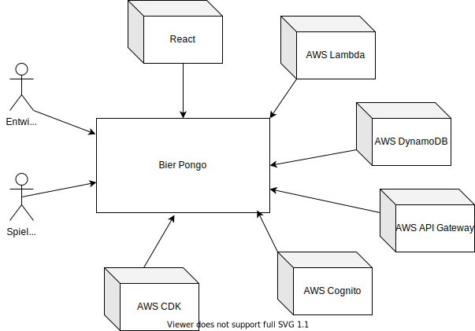

# Problemstellung

## Mision statement

Bier Pongo ist eine Webanwendung, welche es Bierpong-Spielern ermöglicht,
auch räumlich voneinander getrennt zusammen zu spielen und immer den aktuellen Stand des Spielfelds vor sich zu haben. Benötigt wird dafür nur ein Gerät mit Webbrowser und Internetverbindung. Bier Pongo maximiert den Spielspaß dank intuitiver Bedienung, die keiner ausführlichen Erklärung bedarf.

<br><br>

## Kontextabgrenzung

Im Folgenden wird das Gesamtsystem als Blackbox dargestellt.
Alle verwendeten externen Systeme werden als Box um die Anwendung "Bier Pongo" herum dargestellt. Der menschliche Akteur "Spieler" kann in diesem Fall als Plural aufgefasst werden, da an einem Bierpong-Spiel immer zwei Spieler beteiligt sind.

<br><br>



Für die Entwicklung des Frontend wird die JavaScript Library "React" verwendet. Das Backend bilden die Dienste "Lambda" und "DynamoDB" von AWS. Als Schnittstelle dient der Dienst "AWS API Gateway", um Daten im jeweilig gewünschten Format abzurufen. Für die Benutzerverwaltung wird "AWS Cognito" verwendet. Um alle Dienste von AWS per Infrastructure as Code zu orchestrieren, wird das "AWS CDK" (Cloud Development Kit) benutzt.

_TODO: Wo wird der React-Projektordner abgelegt? (EC2, S3)_

<br><br>

## Qualitätsziele

| Qualitätsziel        | Beschreibung                                                                                                 |
| -------------------- | ------------------------------------------------------------------------------------------------------------ |
| Gute Benutzbarkeit   | Bier Pongo ist für die Spieler intuitiv zu bedienen und ohne Erklärung spielbar.                             |
| Hohe Zuverlässigkeit | Das System steht den Spielern jederzeit zur Verfügung und bildet den Spielstand live ab.                     |
| Gute Wartbarkeit     | Bier Pongo ist ohne großen Administrationsaufwand betreibbar und leicht um zusätzliche Features erweiterbar. |

_TODO: evtl. noch 1-2 weitere Ziele definieren_

<br><br>

## Entscheidende Rahmenbedingungen

| Vorgabe                   | Beschreibung                                                                                                             |
| ------------------------- | ------------------------------------------------------------------------------------------------------------------------ |
| Zeitlicher Rahmen         | Das Projekt ist innerhalb von 5 Kalenderwochen abzuschließen.                                                            |
| Technischer Anspruch      | Das Projekt muss mind. einen der Themenbereiche BigData / Cloud / NoSQL in einer hinreichend technischen Tiefe bedienen. |
| Einfachheit der Anwendung | Die Anwendung soll aber so einfach gehalten werden, dass sie im gegebenen Zeitraum umgesetzt werden kann.                |

<br><br>

# Lösungsstrategie

## Lösungsansätze

Die zuvor benannten Qualitätsziele wurden beim Projekt Bier Pongo folgendermaßen brücksichtigt:

| Ziel                 | Lösungsansatz                                                                                                                                                                                                                                                                                    |
| -------------------- | ------------------------------------------------------------------------------------------------------------------------------------------------------------------------------------------------------------------------------------------------------------------------------------------------ |
| Gute Benutzbarkeit   | <ul><li>Dank der simpel gehaltenen React-Oberfläche kann die Anwendung direkt ohne Tutorial o.Ä. benutzt werden.<li> Kennt man die Regeln des "Real-Life"-Spiels kommt man ohne Einweisung direkt zurecht. <li>Die Benutzer benötigen lediglich einen Webbrowser.</ul>                           |
| Hohe Zuverlässigkeit | <ul><li>Da sämtliche Infrastruktur durch Dienste von AWS bereitgestellt wird, ist die Anwendung praktisch ohne zu erwartende Ausfälle verfügbar. <li> Den einzigen Flaschenhals stellt die Internetverbindung des Benutzers dar.</ul>                                                            |
| Gute Wartbarkeit     | <ul><li>Durch Nutzung des AWS Clous Development Kit können etwaige Änderungen an der Infrastruktur im Code getätigt und anschließend deployed werden. <li>Zusätzliche Features können für das separate React-Frontend entwickelt werden, ohne dadurch das Backend auf AWS zu beeinflussen. </ul> |

## Technologie-Stack

Das Frontend von Bier Pongo besteht aus einer React-Anwendung in einem Docker-Container.

Die Backend-Infrastruktur besteht aus Diensten von AWS. Die Brücke zwischen React und AWS bildet eine REST-API, realisiert durch AWS API-Gateway. Die zur Verfügung gestellten Endpoints nehmen API-Aufrufe von Seiten React entgegen und bedienen diese, indem AWS Lambda-Funktionen aufgerufen werden. Durch die Lambda-Funktionen werden die Spiel-Daten aus der AWS DynamoBD gelesen und geschrieben.

Für die Verwaltung der AWS Infrastruktur wird per Infrastructure as Code das AWS Cloud Development Kit verwendet.

<br><br>


<br><br>

# Lösungsdetails

## Architekturentscheidung

Die Wahl des Frontend-"Frameworks" fiel auf die JavaScript-Library React, da sich mit ihr leicht moderne User Interfaces erstellen lassen und im Entwicklerteam schon Erfahrungen mit React und JavaScript im Allgemeinen vorhanden waren. Für React sprach auch die Modularität mittels Components. Diese sind wiederverwertbar und austauschbar und konnten unabhängig voneinander entwickelt werden.

Damit die Applikation von allen Entwicklern ohne Kompatilitätsprobleme auf z.T. unterschiedlichen Betriebssystemen gebaut, entwickelt und getestet werden kann, lag es nahe dafür einen Docker-Container zu verwenden. Auch nach der Entwicklungszeit ist geplant, den Docker-Container auf AWS Elastic Container Service zu hosten.

Das Backend wird komplett durch Dienste von AWS gebildet. Sämtliche Services werden über das AWS Cloud Development Kit per Infrastructure as Code definiert.

Das AWS API-Gateway stellt verschiedene Endpoints zur Verfügung, damit die React-App auf Spiel-Daten zugreifen kann. Für die API-calls wird die Bibliothek axios verwendet.
Das API-Gateway ruft abhängig vom Typ der Anfrage die entsprechende Lambda-Funktion auf.

Alle Lambda-Funktionen sind in der Programmiersprache Python geschrieben, da das Team hier auch schon Erfahrung hatte. Mithilfe der Python-Bibliothek boto3 werden die Spieldaten, welche in einer Datenbanktabelle der AWS DynamoBD liegen, in der Lambda-Funktion gelesen und geschrieben. Näheres zu den einzelnen Lambda Funktionen wird im nachfolgenden noch beschrieben.

In der AWS DynamoDB Datenbank liegt lediglich eine Tabelle, welche für jedes Spiel die Spiel-ID sowie den Spielstand (getroffene Becher) speichert. Die Daten gelangen anschließend über das API-Gateway zurück zur aufrufenden React-App. Entsprechend gilt der beschriebene Weg für das updaten eines Spiels.

<br><br>
# Beschreibung der Lambda Funktionen
## POST-Lambda

Request-Typ: POST-Request

Aufgabe: Erstellen eines neuen Spiels

Beschreibung: Die POST-Lambda erstellt eine neue eindeutige GameId mit 8 Zeichen. Anschließend schreibt Sie ein neues Item in die Datenbank, das wie folgt aufgebaut ist: 

```
{
    "GameId": game_id,
    "State": "", 
    "playerCount": 1
}

```

Response: 

* 200 OK
* 500 Error bei Erstellung des Spiels

<br>

## GET-Lambda

Request-Typ: GET-Request

Aufgabe: Die GET-Lambda ist dafür zuständig Spielstand abfragen zu bewerkstelligen.

Beschreibung:
Die GET-Lambda liefert das Item zur gegebenen GameId zurück.

Response:

* 200 OK
* 404 Spiel nicht gefunden

<br>

## PUT-Lambda

Request-Typ: PUT-Request

Aufgabe: Die PUT-Lambda wird dazu benutzt den Spielstand nach jeder Runde anzupassen.

Beschreibung:
Die PUT-Lambda erhält eine GameId und den State-String der letzten Spielrunde und fügt Sie zum bereits vorhandenen State-String in der Datenbank hinzu. 

Response:

* 200 OK
* 400 Invalide GameId 
* 500 Error beim updaten des Spiels
<br>

## JOIN-Lambda

Request-Typ: GET-Request

Aufgabe: Die JOIN-Lambda lässt andere Spieler oder Zuschauer einem vorhandenen Spiel beitreten.

Beschreibung:
Die JOIN-Lambda nimmt eine GameId entgegen, erhöht "playercount" in der Datenbank und schickt den aktuellen playercount sowie die GameId zurück.

Response:

* 200 OK
* 404 Spiel nicht gefunden
* 500 Error beim Beitritt


## TODO: Verhalten

Im Folgenden wird der Ablauf eines Spiels beispielhaft in Stichpunkten beschrieben:

- Spieler 1 öffnet die URL und erstellt ein Spiel.
- Über den "post"-Endpoint wird das API-Gateway dazu aufgefordert, die entsprechende post-Lambda-Funktion aufzurufen.
- Die Lambda-Funktion erstellt eine zufällige, eindeutige Spiel-ID und speichert diese in der Datenbanktabelle ab.
- Spieler 2 öffnet die URL und tritt dem von Spieler 1 erstellten Spiel durch Eingabe der Spiel-ID bei
- Über den "join"-Endpoint wird das API-Gateway dazu aufgefordert, die entsprechende join-Lambda-Funktion aufzurufen.
- Die Lambda-Funktion erhöht die Spieler-Anzahl des entsprechenden Spiels um 1
- Nun nutzen beide Spieler die gleiche URL, welche die Spiel-ID enthält, um zu spielen
- **TODO: ANZEIGE DES AKTIVEN SPIELERS? SPIELER-ID?**
- Spieler 1 trifft beispielsweise einen Becher, klickt diesen an und beendet anschließend seinen Zug
- **TODO: WIE SIEHT DER STRING AUS, DER ÜBERGEBEN WIRD?**
- String wird per API-call dem API-Gateway übergeben.
- Der API-Gateway ruft die put-Lambda-Funktion auf, um die Spieldaten in der Datenbank zu aktualisieren
- Dabei wird dem State (Spielstand) der String angehängt
- Spieler 1 und 2 spielen abwechselnd bis eine Seite alle Becher getroffen hat
- **TODO: WAS PASSIERT, WENN DAS SPIEL BEENDET IST?**

  <br><br>

# TODO: Fazit und Ausblick

Derzeitiger Stand:

- MUSS
  - Spiel erstellen & beitreten möglich
  - Spiel eintragen möglich
- SOLL
  - Userverwaltung nicht geschafft
  - Historie nicht geschafft
- KANN
  - PW vergessen nicht geschafft.

Nächste Schritte:

- Fertigstellung der geplanten Features
- Zukünftiges hosten des Docker-Containers in AWS ECS
